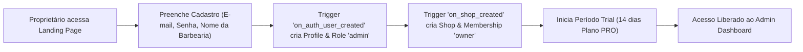
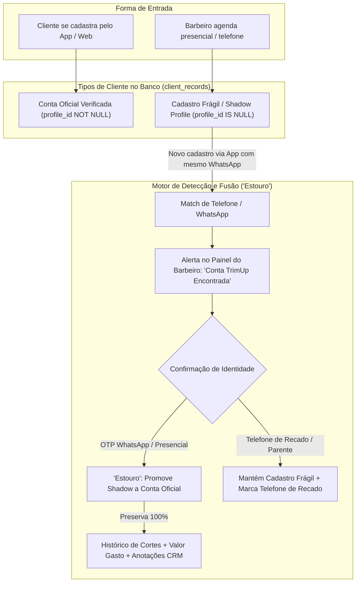
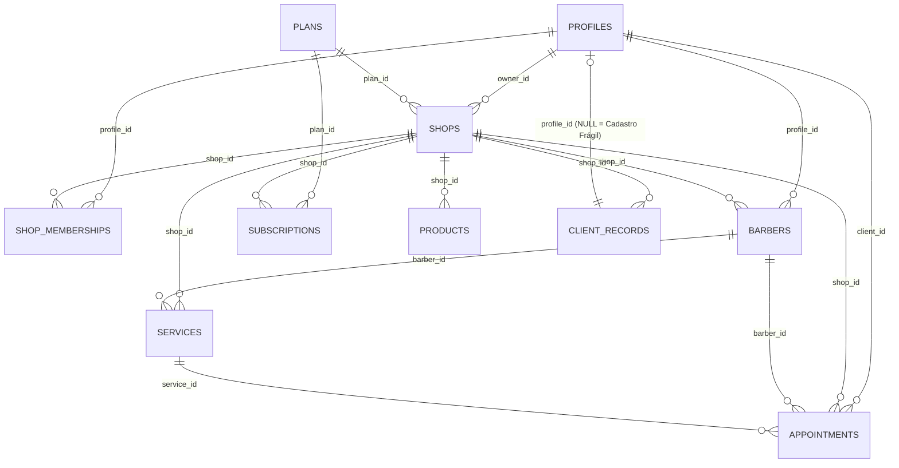
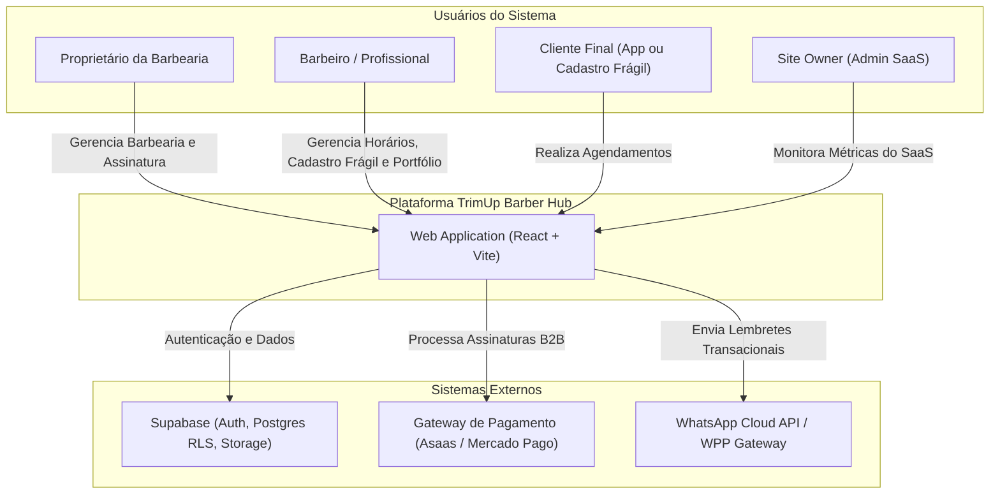
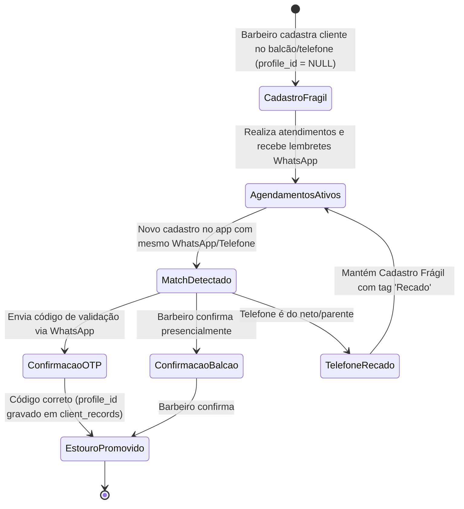
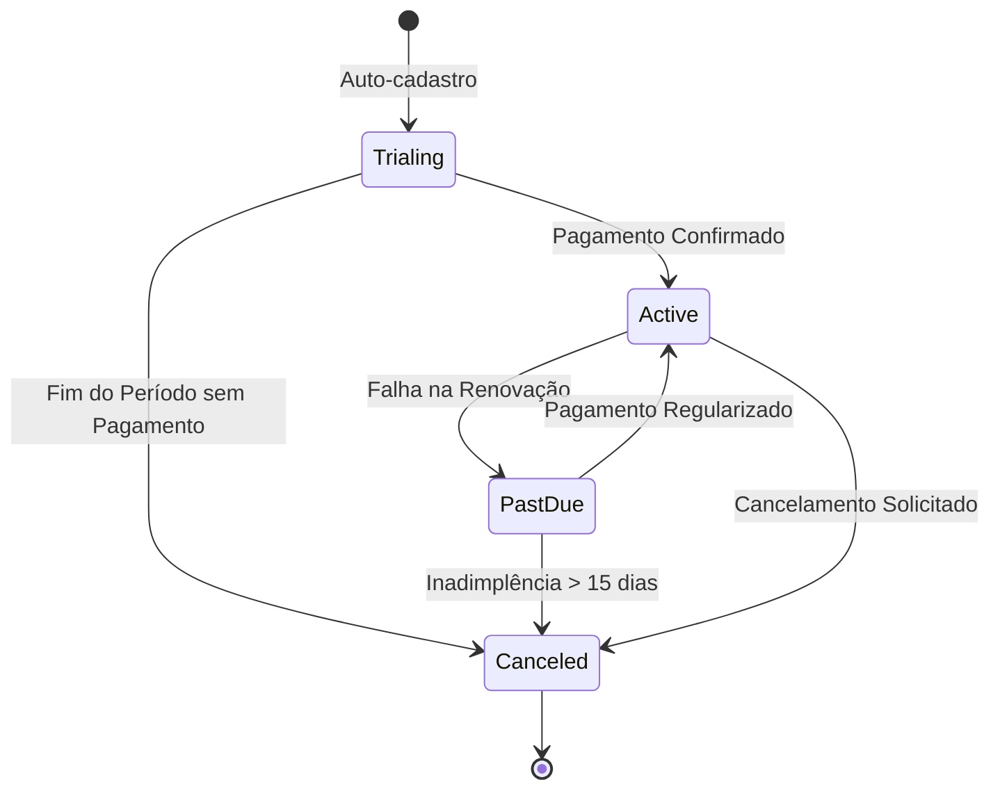

# 📄 DOCUMENTO DE VISÃO, ESCOPO, ARQUITETURA E USE CASES — TRIMUP BARBER HUB (v0 / MVP)

> **Status:** Proposta Técnica & Negócio Aprovada  
> **Data:** Setembro de 2026  
> **Projeto:** TrimUpBarberHub  
> **Arquitetura:** SaaS Multi-Tenant (React + Supabase/PostgreSQL + Edge Functions + WhatsApp Gateway)

---

## 📌 SEÇÃO 0 — ALINHAMENTO CONCEITUAL & DEFINIÇÃO DO MVP

### 0.1 Definição de MVP para o TrimUp
O **MVP (Minimum Viable Product)** do TrimUp é a versão inicial comercializável que resolve a dor central dos dois lados do mercado:
1. **Para as Barbearias (B2B):** Elimina o caos de agendamentos via WhatsApp informal, oferece gestão de equipe/horários, reduz no-shows com lembretes automáticos e garante controle financeiro básico.
2. **Para os Barbeiros (Profissionais):** Garante a gestão da sua agenda e a construção do seu **Perfil de Carreira Independente (CRB)** com portfólio de cortes e histórico verificado de atuação.
3. **Para os Clientes (B2C):** Oferece agendamento rápido em menos de 1 minuto, sem necessidade de baixar app pesado (Web App Responsivo / PWA).

---

### 0.2 Esclarecimento Crítico sobre Pagamentos no MVP
Existem **dois fluxos financeiros totalmente distintos** no ecossistema do TrimUp:

| Tipo de Pagamento | Descrição | No MVP v0? | Como Funciona no MVP? |
| :--- | :--- | :---: | :--- |
| **1. Assinatura B2B (Barbearia ➔ TrimUp)** | Cobrança recorrente dos planos do SaaS paga pela barbearia ao Site Owner (você). | **SIM (Obrigatório)** | Integração via API de Gateway (Asaas / Mercado Pago / Stripe). Processa Pix e Cartão de Crédito recorrente. Controla status da assinatura (`active`, `trialing`, `past_due`, `canceled`). |
| **2. Pagamento B2C (Cliente ➔ Barbearia)** | Transação do valor do corte/barba paga pelo cliente final no ato do agendamento ou do atendimento. | **NÃO (Presencial)** | O pagamento do serviço é feito **presencialmente na barbearia** (dinheiro, Pix da barbearia, máquina física). O TrimUp apenas registra o valor financeiro do atendimento no fechamento do comissionamento. |

---

## 📌 SEÇÃO 1 — VISÃO, ESCOPO E LIMITES DO PRODUTO

### 1.1 Core do TrimUp no MVP
O núcleo do TrimUp na v0 é:  
**"Agendamento Multi-tenant Inteligente + Cadastro Frágil de Clientes + CRM via WhatsApp + Perfil de Carreira Portável do Barbeiro + Gestão de Assinaturas B2B."**

---

### 1.2 Módulos Obrigatórios da v0 (MVP)
Para garantir lançamento rápido e valor imediato, a v0 conterá **exatamente 4 módulos essenciais**:

1. **Módulo de Agendamento & Gestão de Agenda:** Calendário responsivo, bloqueio de horários, configuração de grade por barbeiro, agendamento para clientes cadastrados e agendamento via **Cadastro Frágil (Shadow Profile)**.
2. **Módulo de Perfil de Carreira (CRB):** Portfólio do barbeiro, biografia, fotos de cortes, especialidades e histórico auditado de vínculo com barbearias.
3. **Módulo CRM & Notificações WhatsApp:** Envio de confirmação imediata, lembretes pré-atendimento (gatilho de 2h antes), atalhos rápidos via link Direct (`wa.me`) e fusão inteligente de contatos.
4. **Módulo de Gestão Multi-Tenant & Assinaturas B2B:** Dashboard administrativo para a barbearia, controle de planos, limitação por barbeiros e portal de métricas do Site Owner.

---

### 1.3 Unidade de Compra do Software
- **Quem assina o TrimUp:** A **Barbearia (Tenant / Shop)**.
- **Regra de Negócio:** O proprietário da barbearia assina o SaaS para liberar a infraestrutura de agendamento e gestão para o seu estabelecimento.
- **Barbeiros e Profissionais:** Não pagam mensalidade para trabalhar na barbearia. O perfil individual (CRB) é gratuito para o profissional.

---

### 1.4 Matriz de Planos & Limitações do SaaS (FREE / PRO / PREMIUM)

| Módulo / Recurso | Plano FREE (R\$ 0/mês) | Plano PRO (R\$ 79,90/mês) | Plano PREMIUM (R\$ 149,90/mês) |
| :--- | :--- | :--- | :--- |
| **Limite de Barbeiros** | Até 1 Barbeiro | Até 5 Barbeiros | Até 15 Barbeiros (expansível) |
| **Limite de Agendamentos** | 50 agendamentos / mês | Ilimitados | Ilimitados |
| **Unidades / Filiais** | 1 Unidade | 1 Unidade | Múltiplas Unidades (Até 3) |
| **Notificações WhatsApp** | Links manuais (`wa.me`) | Disparos Automáticos (API) | Disparos Automáticos + Campanhas |
| **Cadastro Frágil / Shadow** | Simples | Com Alerta de Fusão | Fusão Automática + Multi-Contato |
| **Gestão de Estoque** | Cadastro simples | Movimentação + Alertas | Movimentação + Baixa automática |
| **BI & Analytics** | Dashboard Básico | Ranking + Relatórios | BI Completo + Mapas Geográficos |
| **Personalização** | Slug Padrão | Logo + Banner + Cores | Domínio Próprio / Whitelabel |

---

### 1.5 Região, Idioma, Moeda e Regulamentação
- **Escopo Regional:** **Brasil-only** no lançamento (Brasil / PT-BR / BRL `R$`).
- **Padrões Técnicos:** Telefones no formato `+55 (DD) 9XXXX-XXXX`, fuso horário `America/Sao_Paulo`, máscaras de CPF/CNPJ.
- **Conformidade LGPD:** Termo de consentimento explícito no agendamento online e regras de blindagem de dados entre barbearias (acesso restrito por histórico de agendamento).

---

### 1.6 Estratégia dos Canais de Comunicação (WhatsApp)
- **Modalidade no MVP:** 
  - **Plano FREE:** Botão de ação direta que abre o aplicativo do WhatsApp com mensagem pré-formatada.
  - **Planos PRO/PREMIUM:** Integração via API de Mensageria (WhatsApp Cloud API oficial ou Gateway de Webhook).
- **Escopo da v0:** Notificações transacionais automáticas (Confirmação ao agendar, Lembrete 2h antes, Aviso de cancelamento) funcionando perfeitamente tanto para contas oficiais quanto para **Cadastros Frágeis**.

---

## 📌 SEÇÃO 2 — ARQUITETURA MULTI-TENANT & SEGURANÇA (RBAC)

### 2.1 Onboarding e Nascimento do Tenant


---

### 2.2 Isolamento de Dados & Permissões do Site Owner
- **Isolamento entre Tenants:** Garantido via PostgreSQL **Row Level Security (RLS)**. Cada consulta filtra obrigatoriamente por `shop_id`.
- **Privacidade & Visibilidade do Site Owner (Você):** Painel geral exibe apenas dados agregados e anonimizados.

---

### 2.3 Relacionamento Barbeiro ↔ Barbearia (Vínculo N:N)
O barbeiro possui uma identidade global no TrimUp, permitindo atuar em mais de um estabelecimento com aprovação dupla e registro histórico em `barber_link_history`.

---

### 2.4 Conta Única do Cliente, Cadastro Frágil (Shadow Profile) & Fusão ("Estouro")



#### Regras da Confirmação de Identidade no Fusão ("Estouro"):
1. **Validação Automática por WhatsApp OTP:** Como o cliente validou a posse do número por SMS/WhatsApp OTP ao criar a conta, o sistema sugere a fusão com alta confiabilidade.
2. **Confirmação Presencial no Balcão:** O barbeiro pode disparar um PIN de 4 dígitos via WhatsApp para o cliente confirmar no ato do atendimento.
3. **Gestão de Telefone Compartilhado (Ex: Neto agendando para o Avô):** Se o telefone pertence ao neto e não ao avô (Sr. João), o barbeiro seleciona "Telefone Compartilhado / Recado". O sistema preserva o Cadastro Frágil do avô intacto com todo o histórico e anotações, sem misturar os agendamentos com os do neto.

---

### 2.5 Regras da LGPD & Geolocalização Regional
- **Privacidade do Perfil Global:** Um barbeiro só pode visualizar a ficha e dados de contato de um cliente não-frágil se aquele cliente **já tiver realizado ao menos 1 agendamento prévio naquela barbearia**.
- **Geolocalização & Mapa de Calor Proximidade (LGPD Compliant):**
  - O sistema calcula a distância via `geocode_cache` e `client_record_geography`.
  - A barbearia visualiza **mapas de calor de densidade de clientes próximos** (raio de 2km a 10km) para direcionar campanhas regionais de marketing com dados anonimizados.

---

### 2.6 Matriz de Controle de Acesso Baseado em Papéis (RBAC)

| Módulo / Funcionalidade | Site Owner | Owner (Dono) | Admin (Gerente) | Barber (Barbeiro) | Client (Cliente) |
| :--- | :---: | :---: | :---: | :---: | :---: |
| **Gestão de Planos do SaaS** | CRUD | Leitura / Alteração | - | - | - |
| **Configuração da Barbearia** | - | CRUD | CRUD | Leitura | - |
| **Gestão de Serviços & Preços** | - | CRUD | CRUD | Leitura | Leitura |
| **Agendar para Cliente Cadastrado** | - | CRUD | CRUD | CRUD | Criar Próprio |
| **Criar / Editar Cadastro Frágil** | - | CRUD | CRUD | CRUD | - |
| **Aprovar Fusão de Cadastro ("Estouro")** | - | Executar | Executar | Executar | Confirmar OTP |
| **Ver Financeiro / Comissões** | Geral Anonimizado | Total Barbearia | Total Barbearia | Apenas Própria | - |
| **Perfil Portfólio (CRB)** | - | Confirmar Vínculo | Confirmar Vínculo | CRUD Próprio | Leitura Pública |

---

## 📌 SEÇÃO 3 — CASOS DE USO NÚCLEO (USE CASES v0)

### 3.1 Onboarding e Acesso
- **UC-01 — Criar Barbearia (Tenant):** Proprietário realiza cadastro, informa slug da barbearia e recebe acesso imediato com plano Trial ativado.
- **UC-02 — Autenticação & Login:** Login via E-mail/Senha ou Google OAuth com redirecionamento dinâmico baseado na role do usuário (Site Owner ➔ `/siteowner`, Owner ➔ `/admin`, Barbeiro ➔ `/barber-dashboard`, Cliente ➔ `/`).
- **UC-03 — Gestão de Assinatura:** Escolha e troca de plano via checkout transacional. Modo *read-only* de 7 dias em inadimplência.
- **UC-04 — Convidar e Vincular Barbeiro:** Envio de solicitação de vínculo com aceite em 1 clique.
- **UC-05 — Onboarding do Cliente Final:** Cadastro simplificado no momento da reserva (Nome, WhatsApp, E-mail).

---

### 3.2 Agendamento & Atendimento
- **UC-06 — Configurar Grade & Disponibilidade:** Barbeiro define horários de atendimento, intervalo de almoço e dias de folga.
- **UC-07 — Agendar Horário (Cliente via App):** Seleção de unidade ➔ barbeiro ➔ serviço ➔ data/hora disponível ➔ confirmação com dados de contato.
- **UC-08 — Agendamento Encaixe / Balcão:** Agendamento direto no painel ignorando travas de antecedência.
- **UC-08.1 — Agendamento via Cadastro Frágil (Barbeiro / Balcão):** Barbeiro cria agendamento para clientes sem aplicativo (idosos, telefone, balcão), preenchendo nome (ex: "Sr. João"), telefone, endereço e anotações personalizadas.
- **UC-08.2 — Detecção de Duplicidade & Fusão de Perfil ("Estouro"):** Cruzamento inteligente de telefone/WhatsApp ao tentar reagendar ou ao criar conta no app. Notifica o barbeiro e realiza a fusão preservando todo o histórico de cortes e faturamento acumulado.
- **UC-08.3 — Resolução de Conflitos de Contato (Telefone Compartilhado):** Trata situações em que familiares (ex: neto e avô) compartilham o mesmo número. Permite manter o cadastro do idoso intacto atribuindo a tag "Telefone de Recado".
- **UC-09 — Remarcação de Atendimento:** Permite trocar data/hora com recálculo automático de disponibilidade.
- **UC-10 — Cancelamento de Atendimento:** Cancelamento pelo cliente ou barbearia com notificação via WhatsApp.
- **UC-11 — Check-in & Início do Serviço:** Barbeiro altera status do agendamento para `em_atendimento`.
- **UC-12 — Conclusão de Atendimento & Comissionamento:** Finalização do serviço, registro do pagamento presencial e lançamento no comissionamento do barbeiro.

---

### 3.3 Catálogo de Serviços & Tabela de Preços
- **UC-13 — Cadastrar Serviços:** Definir nome, descrição, categoria, duração em minutos e preço padrão.
- **UC-14 — Preço Personalizado por Profissional:** Permitir valor de serviço diferenciado por barbeiro.

---

### 3.4 Gestão de Estoque Básica
- **UC-15 — Cadastrar Produtos:** Inclusão de itens de revenda e insumos internos.
- **UC-16 — Movimentação de Estoque:** Lançamento de entradas e saídas.
- **UC-17 — Alerta de Baixo Estoque:** Notificação visual ao atingir quantidade limite.

---

### 3.5 CRM & WhatsApp
- **UC-18 — Captura de Consentimento (Opt-in LGPD):** Aceite de termos para comunicação no primeiro uso.
- **UC-19 — Disparo Automático de Lembrete:** Disparo de WhatsApp 2 horas antes do atendimento (funciona para clientes App e Cadastro Frágil).
- **UC-19.1 — Visibilidade de Dados & Geolocalização Regional (LGPD):** Restringe busca pública de clientes e exibe mapas de calor e densidade de clientes próximos (raio de 2km a 10km) para campanhas de retorno sem violar a privacidade.
- **UC-20 — Campanha de Retorno (Reativação):** Listagem de clientes inativos há 30+ dias com botão de envio direto no WhatsApp.

---

### 3.6 BI & Analytics
- **UC-21 — Dashboard de Faturamento & Métricas:** Receita Total, Ticket Médio, Total de Atendimentos e Taxa de Cancelamento.
- **UC-22 — Ranking de Barbeiros & Serviços:** Relatório comparativo por faturamento e popularidade.

---

### 3.7 Perfil de Carreira do Barbeiro (CRB)
- **UC-23 — Montar Portfólio Profissional:** Fotos de perfil, bio, redes sociais e galeria de cortes.
- **UC-24 — Cartão de Identidade Profissional (CRB):** Página pública verificada comprovando atuação e passagens auditadas por barbearias.

---

## 📌 SEÇÃO 4 — MODELO DE DADOS RELACIONAL (ERD)



---

## 📌 SEÇÃO 5 — PACOTE DE DIAGRAMAS ARQUITETURAIS

### 5.1 C4 Model — Diagrama de Contexto (System Context)



---

### 5.2 C4 Model — Diagrama de Containers

```mermaid
flowchart TD
    subgraph ClientLayer["Camada de Apresentação (Frontend)"]
        SPA["React SPA (Tailwind CSS, Lucide Icons)"]
    end

    subgraph BackendLayer["Camada Backend & Banco (Supabase BaaS)"]
        AUTH["Supabase Auth (JWT, OAuth)"]
        REST_API["PostgREST API Engine"]
        DB[(PostgreSQL Database com RLS)]
        STORAGE["Supabase Storage (Imagens, Avatares, Cortes)"]
    end

    subgraph AsyncLayer["Serviços Assíncronos & Workers"]
        CRON["Edge Functions / Cron Job (Lembretes)"]
        WPP_WORKER["Worker WhatsApp Integrator"]
    end

    SPA -->|HTTPS / REST| REST_API
    SPA -->|Autenticação JWT| AUTH
    SPA -->|Upload de Mídia| STORAGE
    REST_API -->|Executa Consultas, Matching de Fusão e Triggers| DB
    CRON -->|Busca Agendamentos Próximos (Oficiais e Frágeis)| DB
    CRON -->|Dispara Payload de Mensagem| WPP_WORKER
    WPP_WORKER -->|HTTPS API| WHATSAPP_API["WhatsApp Cloud API"]
```

---

### 5.3 Máquinas de Estado (State Machines)

#### 1. Ciclo de Vida do Cadastro Frágil (Shadow Profile) ➔ Conta Oficial ("Estouro")


#### 2. Estado da Assinatura B2B (Tenant)


---

## 📌 SEÇÃO 6 — RESPOSTAS CONSOLIDADAS ÀS 10 PERGUNTAS CHAVE (CHECKLIST MVP)

Para aprovação direta e travamento do escopo de execução, aqui estão as respostas definitivas alinhadas com a arquitetura do TrimUp:

| # | Pergunta Chave | Resposta Oficial TrimUp (MVP v0) |
| :-: | :--- | :--- |
| **1** | **Quem paga a assinatura?** | Apenas a **Barbearia (Tenant)**. O barbeiro não paga mensalidade no MVP. |
| **2** | **A assinatura controla o quê?** | Controla **módulos liberados** (ex: WhatsApp automático, Estoque, Fusão de Contatos) e **limites de uso** (nº de barbeiros e agendamentos). |
| **3** | **WhatsApp Próprio ou Central?** | **Estrutura Híbrida:** Instância centralizada da plataforma para disparos automáticos nos planos PRO/PREMIUM e links diretos (`wa.me`) no plano FREE. |
| **4** | **Escopo do CRM WhatsApp no MVP?** | **Lembretes automáticos + Confirmações + Suporte a Cadastro Frágil**. Campanhas de reativação via atalhos em 1 clique. |
| **5** | **Agendamento precisa de pagamento do cliente?** | **NÃO.** O pagamento do cliente final é 100% presencial na barbearia no MVP. |
| **6** | **Barbeiro pode estar em várias barbearias?** | **SIM.** Vínculo N:N com perfis separados e aprovação formal do barbeiro. |
| **7** | **Cliente pode agendar em várias barbearias com a mesma conta?** | **SIM.** Conta global do cliente (`profiles`) com histórico por barbearia (`client_records`). |
| **8** | **O perfil de carreira é público no marketplace?** | **SIM.** Página de portfólio pública (CRB) com histórico verificado de passagens por barbearias. |
| **9** | **Estoque entra no MVP?** | **SIM.** Cadastro simples de produtos com controle básico de entrada/saída e alerta de estoque baixo. |
| **10** | **BI entra no MVP? Quais 3 métricas mínimas?** | **SIM.** As 3 métricas mínimas são: **1) Faturamento Total**, **2) Total de Atendimentos Realizados**, **3) Ranking de Barbeiros/Serviços**. |

---

## 🚀 PRÓXIMOS PASSOS PARA EXECUÇÃO

1. **Documentação 100% Aprovada e Atualizada.**
2. **Executar Scripts SQL de Atualização** no Supabase (compatível com `schema.sql` e a coluna `profile_id` opcional em `client_records`).
3. **Validar Fluxo de Checkout B2B & Motor de Fusão de Cadastro Frágil.**
4. **Disponibilizar a versão v0 comercializável.**
